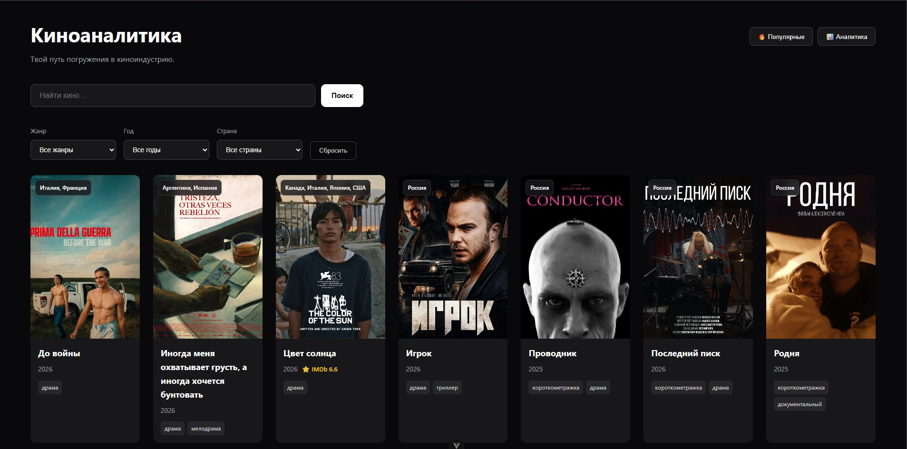
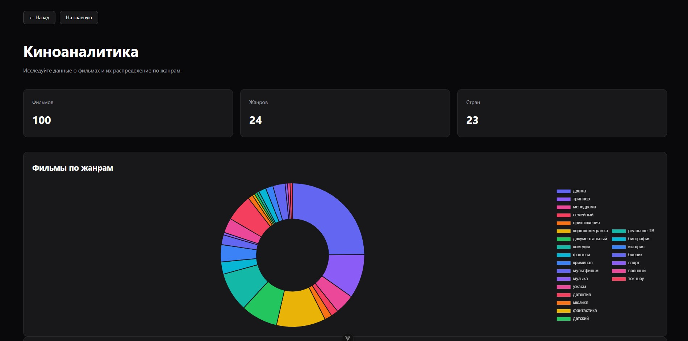
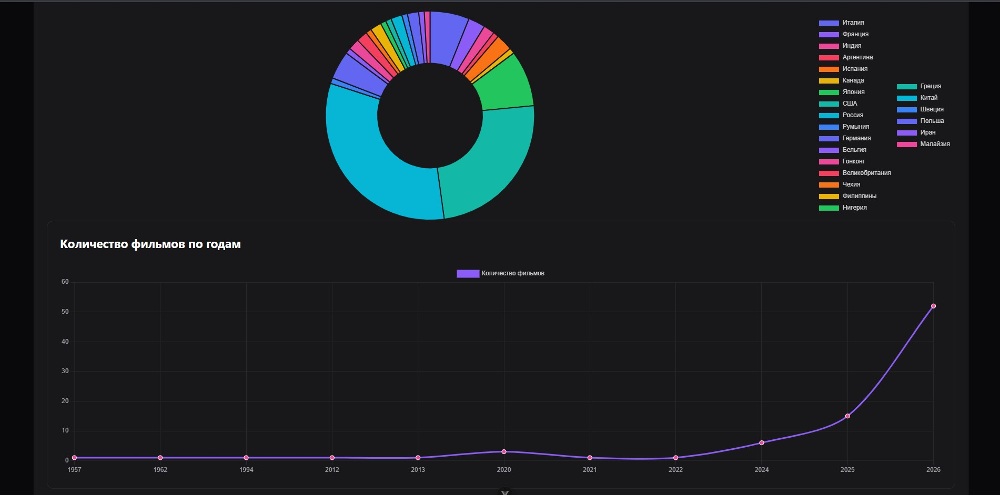
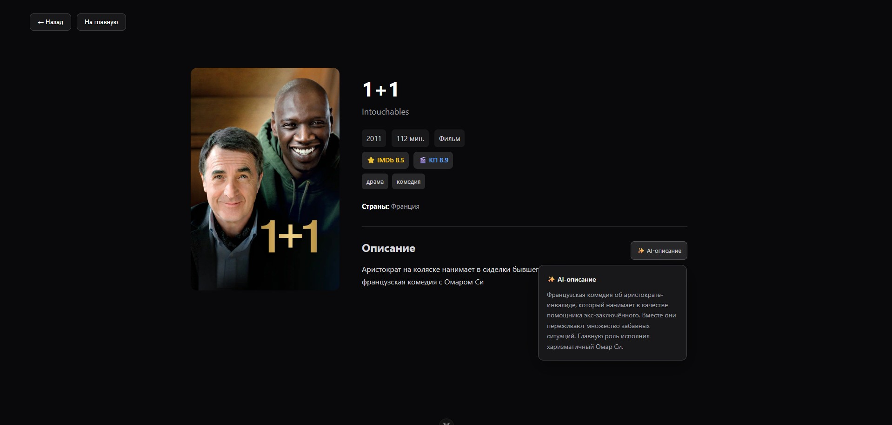
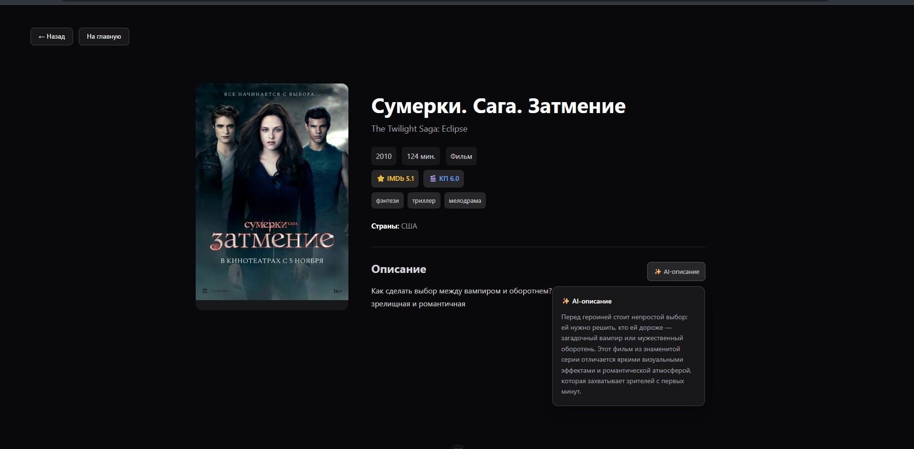
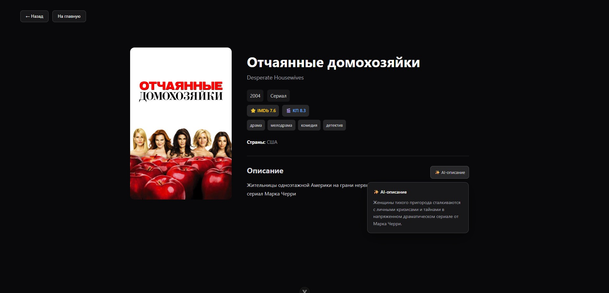
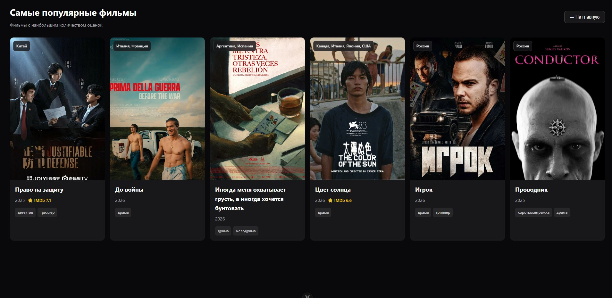
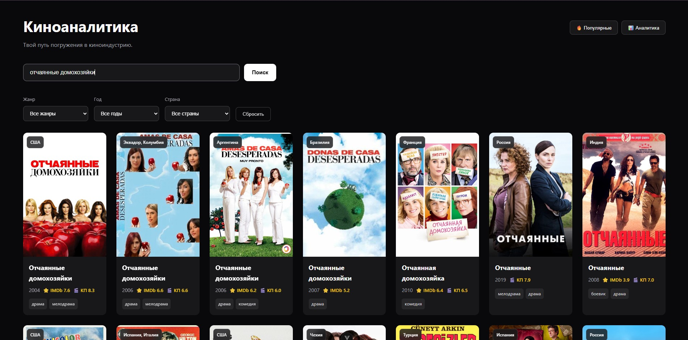
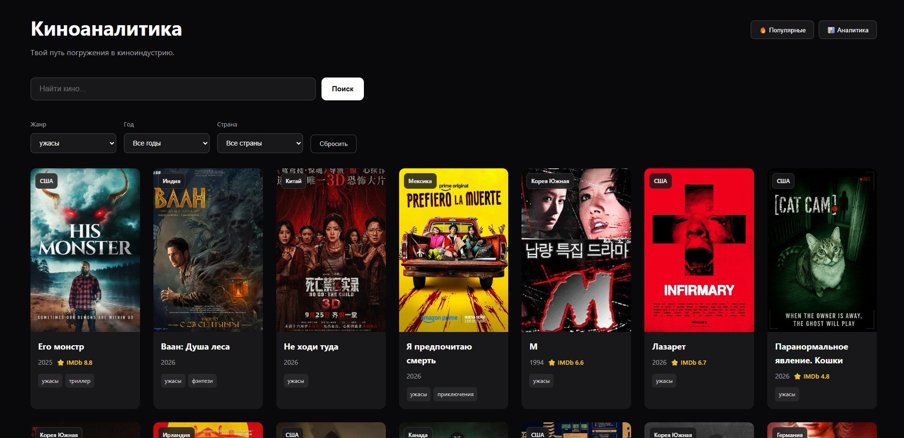

# 🎬 Movie Analytics

Fullstack-приложение для работы с данными о фильмах.

Проект объединяет каталог фильмов, поиск и фильтрацию, рейтинги, визуальную аналитику и AI-генерацию понятных описаний фильмов.

## ✨ Возможности

* 🎥 каталог фильмов
* 🔎 поиск по названию
* 🎛️ фильтрация по жанру, году и стране
* ⭐ отображение рейтингов IMDb и Кинопоиска
* 🌍 отображение стран производства
* 📄 отдельная страница фильма с подробной информацией
* 🔥 отдельная страница популярных фильмов
* 📊 аналитика по жанрам, странам и годам
* 📈 визуализация данных с помощью Chart.js
* 🤖 AI-генерация краткого и понятного описания фильма
* 🔐 хранение API-ключей в переменных окружения

## 📸 Скриншоты

### 🎬 Каталог фильмов

<p align="center">
  
</p>

### 📊 Аналитика

<p align="center">
  
  
</p>

### 🎥 Страница фильма

<p align="center">
  
  
</p>

### 🤖 AI-анализ сериала

<p align="center">
  
</p>

### 🔥 Популярные фильмы

<p align="center">
  
</p>

### ⭐ Фильтры поиска
<p align="center">
  
  
</p>

## 🛠️ Стэк

### Frontend

* Vue 3
* TypeScript
* Vite
* Vue Router
* Pinia
* Axios
* Chart.js
* vue-chartjs

### Backend

* Python
* FastAPI
* Pydantic
* GigaChat API

### External API

* PoiskKino API — данные о фильмах, рейтингах, жанрах и странах
* GigaChat API — генерация описаний фильмов

### Development

* Git
* GitHub
* ESLint
* Prettier

## 🏗️ Архитектура

Проект разделён на frontend и backend.

```text
movie-analytics/
│
├── src/                         # Frontend
│   ├── components/              # Переиспользуемые компоненты
│   ├── views/                   # Страницы приложения
│   ├── services/                # Работа с API
│   ├── types/                   # TypeScript-типы
│   ├── router/                  # Vue Router
│   └── App.vue
│
├── backend/                     # Backend
│   └── app/
│       ├── api/                 # API endpoints
│       ├── services/            # Бизнес-логика и интеграции
│       └── main.py              # FastAPI application
│
├── public/
├── package.json
└── README.md
```

### Как работает приложение

```text
                ┌─────────────────┐
                │   Vue Frontend  │
                │                 │
                │ Catalog         │
                │ Search          │
                │ Filters         │
                │ Analytics       │
                │ Movie Details   │
                └────────┬────────┘
                         │
                    REST / Axios
                         │
            ┌────────────▼────────────┐
            │       FastAPI           │
            │                         │
            │      AI endpoint        │
            └────────────┬────────────┘
                         │
                    GigaChat API


Vue Frontend ────────────────► PoiskKino API
```

## 🤖 AI-функция

На странице фильма доступна AI-функция для генерации более простого и понятного описания.

В качестве исходных данных используется описание фильма, полученное из API.

AI получает инструкцию:

* сохранить основной сюжет;
* не придумывать отсутствующие факты;
* не добавлять спойлеры;
* использовать естественный русский язык;
* сделать текст коротким и понятным.

Запрос к GigaChat выполняется через backend, поэтому секретные credentials не передаются напрямую во frontend.

## 📊 Аналитика

Раздел аналитики визуализирует данные о загруженных фильмах.

Сейчас доступны:

* распределение фильмов по жанрам;
* распределение по странам;
* количество фильмов по годам.

Для визуализации используются:

* Doughnut Chart — жанры и страны;
* Line Chart — распределение фильмов по годам.

## 🔌 API

### PoiskKino

Используется для получения информации о фильмах.

Основные операции:

```text
GET /movie
GET /movie/search
GET /movie/:id
```

Frontend взаимодействует с API через Axios.

### Internal AI API

Backend предоставляет endpoint:

```text
POST /api/ai/movie-description
```

Пример запроса:

```json
{
  "description": "Исходное описание фильма"
}
```

Ответ:

```json
{
  "description": "Сгенерированное описание фильма"
}
```

## 🚀 Запуск проекта

### 1. Клонирование

```bash
git clone https://github.com/cutierinqa/movie-analytics.git
cd movie-analytics
```

### 2. Frontend

Установить зависимости:

```bash
npm install
```

Создать файл `.env` в корне проекта:

```env
VITE_POISK_KINO_API_KEY=your_api_key
```

Запустить development server:

```bash
npm run dev
```

Frontend будет доступен по адресу:

```text
http://localhost:5173
```

### 3. Backend

Перейти в директорию backend:

```bash
cd backend
```

Создать виртуальное окружение:

```bash
python -m venv venv
```

Активировать его в Windows:

```powershell
.\venv\Scripts\Activate.ps1
```

Установить зависимости:

```bash
pip install -r requirements.txt
```

Создать `backend/.env`:

```env
GIGACHAT_CREDENTIALS=your_credentials
GIGACHAT_SCOPE=GIGACHAT_API_PERS
GIGACHAT_CA_BUNDLE_FILE=path_to_certificate
```

Запустить FastAPI:

```bash
uvicorn app.main:app --reload
```

API будет доступно по адресу:

```text
http://127.0.0.1:8000
```

Swagger:

```text
http://127.0.0.1:8000/docs
```

## 🔐 Environment Variables

Секретные ключи не хранятся в репозитории.

Используются:

### Frontend

```env
VITE_POISK_KINO_API_KEY=
```

### Backend

```env
GIGACHAT_CREDENTIALS=
GIGACHAT_SCOPE=
GIGACHAT_CA_BUNDLE_FILE=
```

Для локального запуска необходимо создать собственные `.env`-файлы.

## 📁 Основные страницы

| Route         | Назначение        |
| ------------- | ----------------- |
| `/`           | Каталог фильмов   |
| `/movies/:id` | Страница фильма   |
| `/analytics`  | Аналитика         |
| `/popular`    | Популярные фильмы |

## 📌 Roadmap

Планируемое развитие проекта:

* [ ] PostgreSQL
* [ ] сохранение фильмов в собственной базе данных
* [ ] полноценный backend API для каталога
* [ ] SQL-запросы для аналитики
* [ ] расширенная аналитика
* [ ] Docker / Docker Compose
* [ ] deployment frontend и backend
* [ ] улучшение страницы популярных фильмов
* [ ] дополнительные AI-функции
* [ ] screenshots и demo проекта

## 📚 Цель проекта

Проект создан как pet-project для практики fullstack-разработки и анализа данных.

Основные цели:

* работа с Vue 3 и TypeScript;
* построение REST API;
* интеграция frontend и backend;
* работа с внешними API;
* визуализация данных;
* практика Python и FastAPI;
* интеграция AI-сервисов;
* подготовка проекта к production deployment.

## 👩‍💻 Автор

**cutierinqa**

GitHub: https://github.com/cutierinqa

---

⭐ Если проект был полезен или интересен, можно поставить репозиторию star =)
